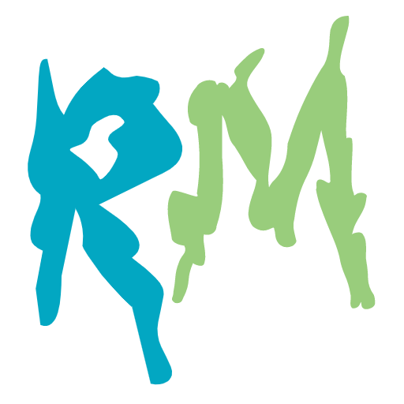

<h3 align="center">REACT & MORTY</h3>

> "The only way to learn a new programming language is by writing programs in it."  
> -- <cite>Dennis Ritchie</cite>

<a href="https://react-and-morty-1337.vercel.app/">https://react-and-morty-1337.vercel.app/</a>

## Overview

This is a React app to render characters from the Rick and Morty API. You will be able to save characters as favorites, see detailed information on a separate page and you can get random characters.

## Used Tech Stack

- React with useState and useEffect hooks
- React Router
- Styled-Components
- JavaScript ES6
- Rick & Morty API
- LocalStorage as data store

## Getting Started

### Installation

`npm install`

### Start app

`npm start`

<a href="http://localhost:3000">http://localhost:3000</a>

## About

I'm looking forward to start exciting projects with you as a 100% remote developer.

You can find more infos about me and my tech stack on my GitHub page.

> "Wubba lubba dub dub"  
> -- <cite>Rick Sanchez</cite>
